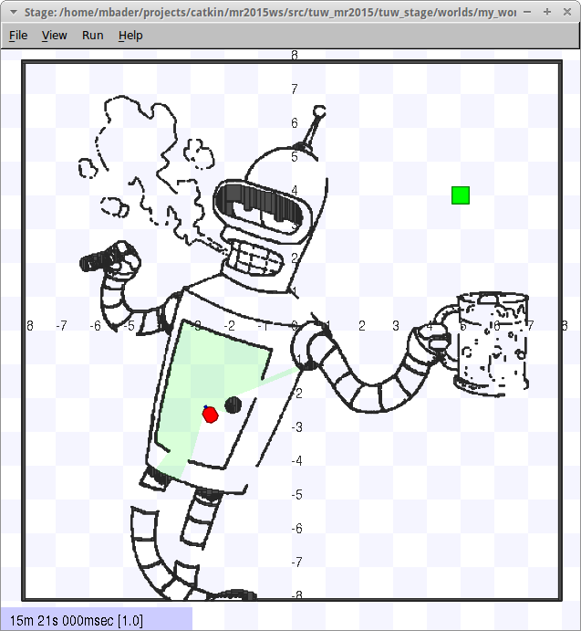
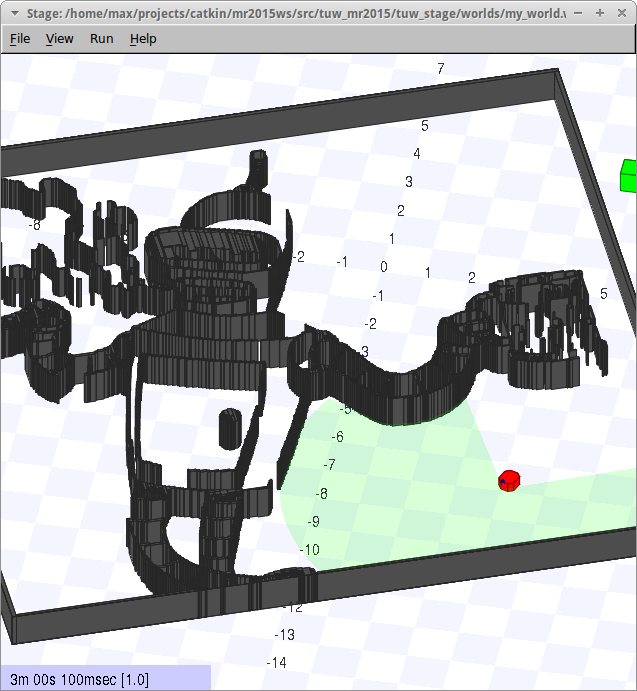
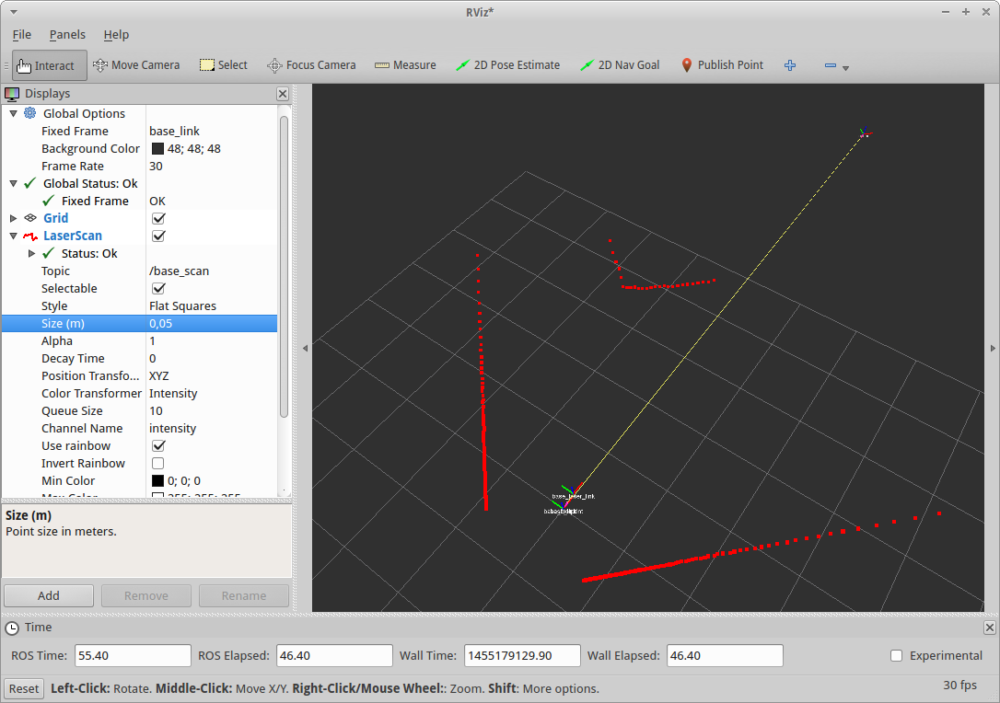
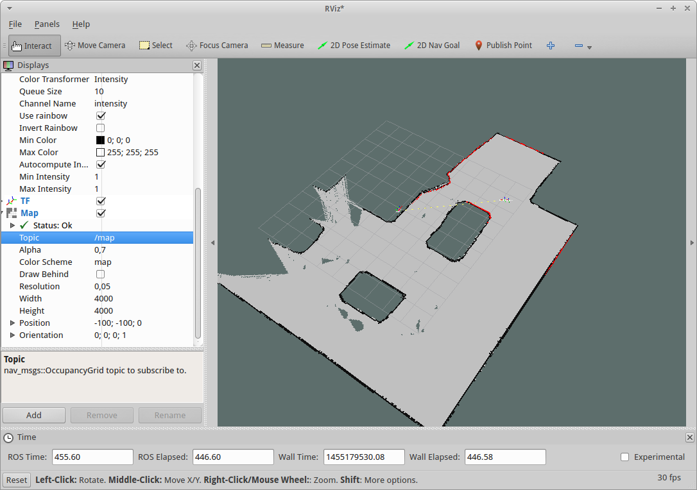
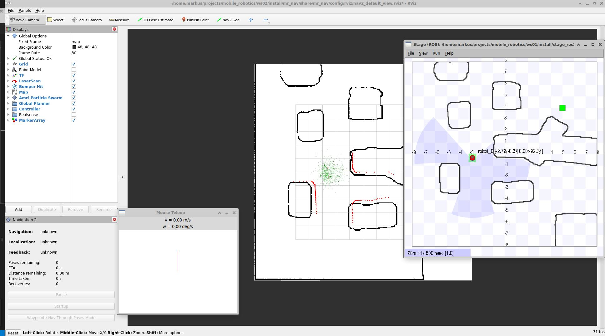
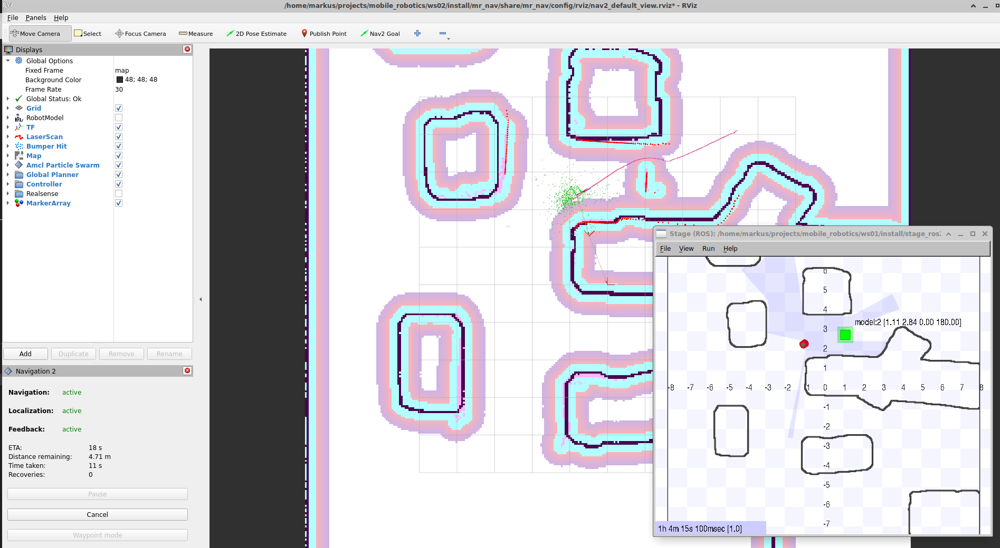
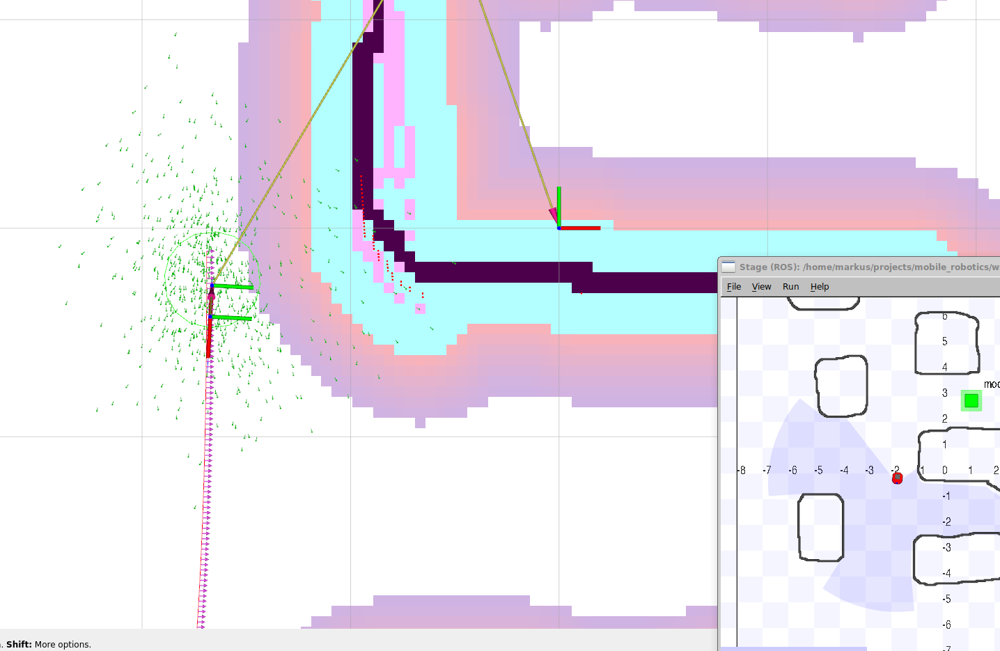

# Introduction {-}

The purpose of this exercise is to get you familiar with ROS and to prepare your system for the upcoming assignments. It is divided into multiple parts:

1. General (18 Points)
2. Simulation (22 Points)
3. ROS2 navigation2 (44 Points)
4. Questions (6 Points)
5. Documentation (10 Points)

Read all instructions carefully and **include all commands used as part of the documentation!**.
Further, document it in such detail, that your actions can be reproduced by others.

Before continuing, make sure your system is prepared according to the instructions within the [project root](https://gitlab.tuwien.ac.at/lva-mr/solutions/2026/root-mr). All further commands are expected to be run within the container.

## Prerequisites {-}

You have to install all relevant tools, if they have not yet been installed.

```sh
sudo apt-get update
sudo apt-get install -y \
    ros-$ROS_DISTRO-teleop-tools \
    ros-$ROS_DISTRO-slam-toolbox \
    ros-$ROS_DISTRO-mouse-teleop \
    ros-$ROS_DISTRO-navigation2 \
    ros-$ROS_DISTRO-nav2-bringup
```

### Update the Exercise Environment

It's good practice to regularly update your local files so you do not miss out on any hotfixes or additional clarifications in exercise descriptions:

```sh
cd $PROJECT_ROOT
git pull
cd ws02/src/mr
git pull
```

# General (18 Points)
First, it's time to get more familiar with the setup and framework. This means you'll need to use a terminal, an editor, and other essential tools.

## bash (6 Points)
Memorize and document the following useful actions, shortcuts, and commands for using the bash:
* **Command History:** How to search for previously typed commands and where they are stored.
* **File & Directory Management:** How to create a folder, a folder with subfolders and an empty file; how to use the `cat` command and how it differs from `tail`.
* **Listing Files:** How to list files (including or excluding hidden ones), view their properties, and understand the meaning of permission strings like `-rw-r--r--`.
* **Piping with Grep:** How to use `grep` in combination with `ls`, `cat`, or other commands.
* **Shell Varieties:** The differences between `bash`, `sh`, and `zsh`.
* **Editor:** What's your favorite file editor for bash? (It should be Vim, don't trust the tutors on this one!) Also, what are the most important shortcuts for using it?

## tmux (6 Points)
Throughout these exercises, the tool __tmux__ will be used extensively. Therefore, we want you to get familiar with it and its shortcuts.
Do not use the VS Code terminal. Instead, use a standard terminal and attach it to the running dev container by executing `make attach`.

Enable mouse support for _tmux_.
Memorize and document five important short-cuts.
Tell us how you enabled the mouse integration and how you can use the middle button for copy and paste, how to split the screen vertically or horizontally and how to detach and attach to sessions.
We would also like you to get familiar with windows/tabs.
Check out how new windows are created and renamed. 

+ Enable mouse support: (1 Point)
+ 5 shortcuts: (1 Point)
+ Using middle mouse button: (1 Point)
+ Split screen: (1 Point)
+ Attach/Detach: (1 Point)
+ Handling Windows: (1 Point)

# Environment and Framework (6 Points)
Be prepared to answer questions regarding the environment and framework used. Use one line or a few keywords per point to summarize your answers in your documentations.

* What does it mean to `source` ROS or the framework? (1 Point)
* Why is there an `env.sh` file, and why does it generate a `.env.local`? (1 Point)
* What is the purpose of the `.devcontainer` folder, and what does it contain? (1 Point)
* What needs to be modified to build a devcontainer for a different ROS version or Linux distribution? (1 Point)
* What is the purpose of the `.bashrc` file, and why is this question being asked? (1 Point)
* How and why are the files .bashrc, env.sh, devcontainer.json, and the Dockerfiles connected. (1 Point)


# Simulation (22 Points)
Now it's time to get more familiar with some essential tools used in this course.
In particular, we will be working with the Stage simulator in order to simulate a physical environment (a "world") for our robot to exist in.

## Starting the Environment (5 Points)
Start the Stage simulator and use the `teleop_twist_keyboard` node to drive a simulated robot as described in the README of the root repository. Document your actions. Note that this is the package installed above using the `apt install` command, other packages can be installed similarly.

## Make your own World (12 Points)
Make a copy of the `cave.world` file and change it such that it looks like your favorite environment.
For example, I created a Bender environment.
Your documentation must contain a screenshot of your environment and a few sentences (2-3) on how you made this change.
The world file nearly explains itself, but if you like to know more, have a look at: [http://rtv.github.io/Stage/](http://rtv.github.io/Stage/) (be aware that there is an old/outdated version of Stage on SourceForge).

{ width=50% }
{ width=50% }

## Change the robot (5 Points)
This task might take some time, so feel free to skip it and come back after you have finished the other tasks.
* Give your robot a different color (2 Points)
* Add a second laser scanner to the robot (1 Point)
* Add a camera to the robot (1 Point)
* Add a fiducial sensor to the robot (1 Point)

# Nav2 (44 Points)

[nav2](https://docs.nav2.org/) includes nodes to

* Create a map using a SLAM approach (`slam_toolbox`),
* Save the map (`map_saver`),
* Publish a map (`map_server`),
* Self localize (`amcl`),
* Navigate (`move_base`).

Your task is to use these packages to navigate between two points and to document your approach. Screenshots and 2 sentences are normally enough, but you might have to explain what you did in your submission talk.

## RViz (9 Points)

Start the simulation and `teleop_twist_keyboard`, same as in the previous sections. In this task you need to visualize the robot's perception of its environment using `rviz`.

```sh
ros2 run rviz2 rviz2 
```
- Define __base_link__ as *Fixed Frame* and add the LaserScan (topic: __base_scan__) as well as the TF topic. (3 Points)
- When inspecting the settings rviz presents for displayed topics, you can find options regarding the topics Quality of Service.
    - Document what this term means in the context of ros2. (2 Points)
    - Which QoS-profiles are available in ros2 and how do they differ from one another? (1 Point)
    - To which degree are different QoS settings compatible with each other? (1 Point)

{width=60%}

If you managed to add a second laser scanner and/or a camera, show us how to visualize this sensor data using RViz. (2 Points)

## slam_toolbox (10 Points)

Create a map of your own environment using the `slam_toolbox`.
Visit [https://docs.nav2.org/tutorials/docs/navigation2_with_slam.html](https://docs.nav2.org/tutorials/docs/navigation2_with_slam.html) to find the correct command to start mapping.
To see the result, you have to add the map topic to your RViz view and to change the Fixed Frame to `map`. 



__Hints:__ 

- It helps to use *tmux* instead of multiple terminal windows or tabs. You need at least five terminals!
 - `ros2 launch stage_ros2 stage.launch.py`
 - `ros2 run rviz2 rviz2`
 - `ros2 run teleop_twist_keyboard teleop_twist_keyboard`
 - `your command for mapping`
 - `to save the map (next section)`
- Check out the readme.md to the mr_nav project in your workspace. There is a (mostly) working configuration!

## `map_saver` (5 Points)

Save your created map using the `map_server` node and the command documented at [https://index.ros.org/p/nav2_map_server/](https://index.ros.org/p/nav2_map_server/). Do not overwrite the cave map! Make your own map!

## `map_server` (5 Points)

Fix any holes or other issues present in your map using an image editor. Then, use the `map_server` to publish the map statically to the `/map` topic. (Make sure not to publish to a topic from multiple sources!)

__Hints:__ 
 
- <https://answers.ros.org/question/406036/how-to-publish-map-in-ros2-galactic/>
- Pay attention to the indentations in the configuration file.
- Do not forget to send the relevant lifecycle messages from a separate console.

## AMCL Self Localization (5 Points)

AMCL should be used for self-localization to establish a link between your map and the robot base. Details can be found at [https://github.com/ros-planning/navigation2/tree/main/nav2_amcl](https://github.com/ros-planning/navigation2/tree/main/nav2_amcl). (Sadly, the documentation is still lacking and not very good.)

To start the self-localization, run the below command. After this, you need to initialize the system, by specifying an initial pose using the "2D Pose Estimate" button in rviz.

```sh
ros2 launch mr_nav localization_launch.py map:=$PROJECT_ROOT/.......
```

Now you can drive using the teleop node, and you will hopefully see the robot on the correct spot. The particles used for the self localization can be visualized as a `nav2_msgs/msg/ParticleCloud` from the topic ParticleCloud.
You will receive 4 Points for the working amcl and 1 Point if you can drive with `mouse_teleop` as shown in the screenshot.



## Nav2 (5 Points)

The navigation package is very complex, therefore we provide you with a launch file as a starting point.

```sh
ros2 launch mr_nav navigation_launch.py
```

After you launched Nav2, you should be able to tell the robot where it should go using the 2D Nav Goal button in RViz (1 Point).
To get some indication of what is going on, you can visualize the cost maps (2 Points) as well as the path (2 Points) in RViz.





## Tweaking Navigation (2 Points)

Check out the navigation stack https://docs.nav2.org/, and you will see how complex it is.
A good way to tweak it is to have a look at the navigation_launch.py and the parameter files used there.
Change some parameters (e.g. a costmap parameter) and document the differences.

## Launch File (3 Points)

Create a ros2 python launch file to start everything except the simulation environment (hint: take a look at the already existing launch files in the mr_nav/launch/nav2-folder).

# Questions (6 Points)

Create a markdown document named `questions_ex1_{YOUR_STUDENT_ID}.md` in the `ws02/src/mr/exercises` folder containing three multiple-choice questions related to the exercise: one easy, one medium, and one expert level. 
Each question and its four answer options must be no longer than 200 characters each.
The document must follow the format below:
Replace **YOUR_NAME**, **YOUR_STUDENT_ID**, **TRUE**, and **FALSE** with your actual name and student ID.
Set the answer to **true** if the option is correct; otherwise, set it to **false**.
Upload your questions file, `questions_ex1_{YOUR_STUDENT_ID}.md`, alongside the documentation PDF. 

```
# Mobile Robotics
## Questions
* Author: YOUR_NAME
* StudentID: YOUR_STUDENT_ID
* Semester: 2026S

### Exercise 1

#### Easy Question
Your Question
* [FALSE] Answer option 1
* [TRUE] Answer option 2
* [FALSE] Answer option 3
* [FALSE] Answer option 4

#### Medium Question
Your Question
* [TRUE] Answer option 1
* [TRUE] Answer option 2
* [FALSE] Answer option 3
* [TRUE] Answer option 4

#### Expert Question
Your Question
* [FALSE] Answer option 1
* [TRUE] Answer option 2
* [TRUE] Answer option 3
* [FALSE] Answer option 4
```

# Documentation (10 Points)

* Your documentation should not be more than 5-6 pages (1 Point) - primarily screenshots (Alt-Print or Shift Print). In this assignment, the documentation will be the only thing you have to submit, no code.
* Document every step with screenshots, for the tasks "Tweaking Navigation" and "Launch File" you can add the files with a brief inline documentation (5 Points).
* The first page includes your full name and student ID, and a table showing how many points you think you have reached. (2 Points)
* Document your working hours. We would like an estimate of how long it took you to set up and prepare your system, as well as the total hours spent on the exercise. (2 Points)

# Optional Exercises and Bonus Points (5 Points)

## Optional exercises

Work through the [Using turtlesim and rqt](https://docs.ros.org/en/jazzy/Tutorials/Beginner-CLI-Tools/Introducing-Turtlesim/Introducing-Turtlesim.html).

## Bonus points

Document the following tasks in your Documentation to get points.

* Use `rqt_graph` to visualize the nodes running (1 Point)
* Add a bonus question to the `questions_ex1_{YOUR_STUDENT_ID}.md` (1 Point)
* Change an algorithm used in nav2 (2 Points)
* Write an installation description for the project root for MacOS (1 Point)

