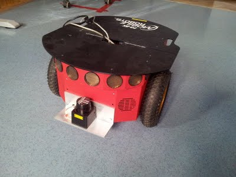
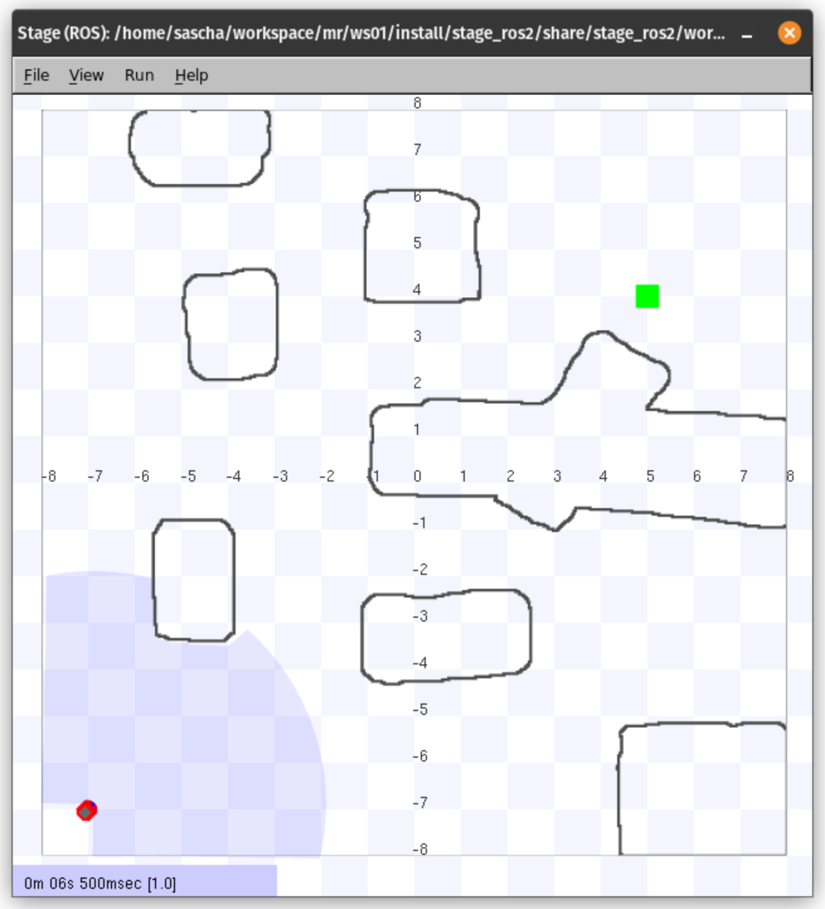
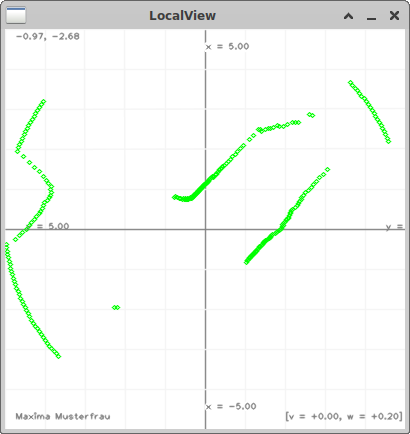
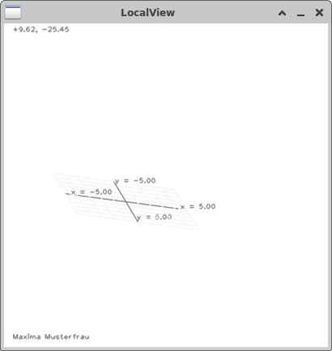
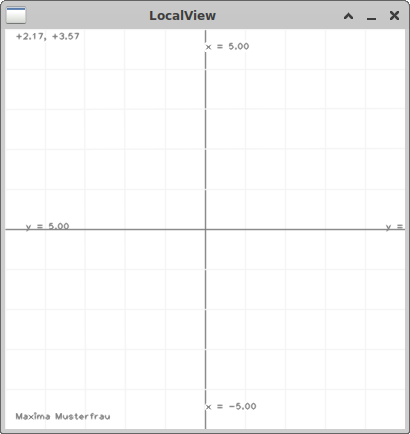
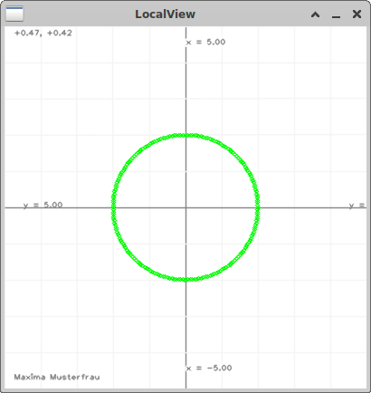
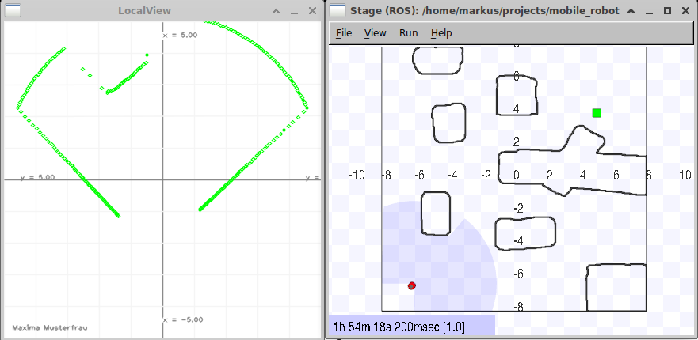
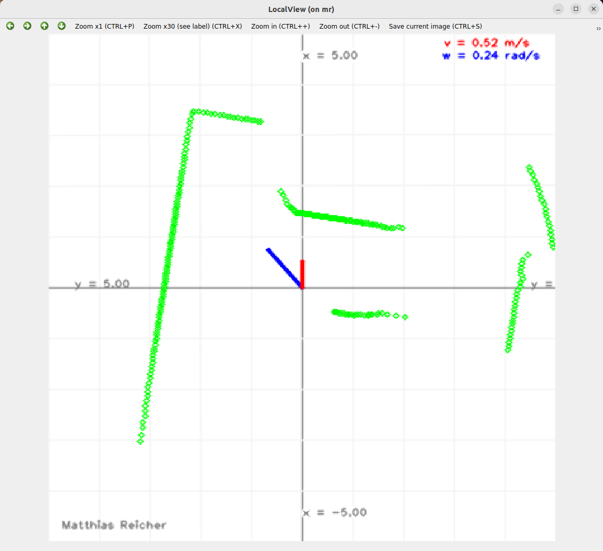
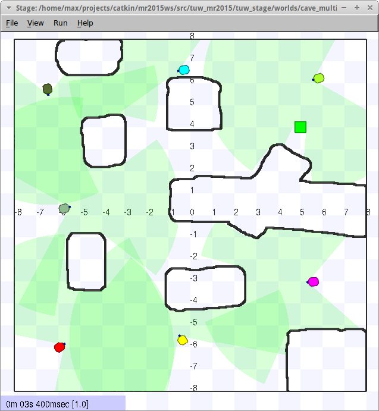
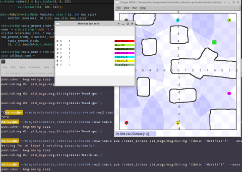

# Introduction {-}

In this exercise, you will implement a robot control enabling a simulated robot to move around in a room while avoiding collisions with any objects. The environment is perceived through a laser sensor at the front of the robot. The following Figures show one of the real robots at our lab and its simulated counterpart.




The exercise is divided into multiple parts:

1. Background (10 Points)
2. Visualization of Measurements (40 Points)
3. Moving the Robot (30 Points)
4. Competition (4 Points)
5. Questions (6 Points)
6. Documentation (10 Points)

The exercise must be solved independently and submitted until the respective TUWEL submission deadline. Late submissions will not be graded! It is important that your code compiles **without any errors or warnings**.

For the first part of the exercise, you need to process and visualize the laser measurement data.

The second part addresses the controlling and implementation of the so-called "Wanderer", which allows a robot to move around a room while avoiding collisions. In order to solve this problem, you will have to familiarize yourself with the given framework a bit.
You also have to rename your `mr_move` package so that its name is unique in the system to participate in our multi-robot-challenge.

The last part consists of the documentation of your work. You will have to answer some questions and provide screenshots of your work.

## Framework - Code Construct

For this exercise, you need to have completed the __Installation and Setup__ and the first exercise.
First update/pull, build and source the framework:
```bash
cd $PROJECT_ROOT
git pull
git pull ./ws02/src/mr
make build-ws00
make build-ws01
make build-ws02
source ./env.sh
```

Start the simulation, then the local planner node and finally the visualization, each with a separate command. In this way, you can restart the planner without restarting the simulation.
```bash
  ros2 launch stage_ros2 stage.launch.py world:=cave # This starts the simulator
  ros2 run mr_move move_node.py --ros-args -p mode:="demo" --remap scan:=base_scan # This starts the Wanderer
  ros2 run mr_viz local_view --ros-args --remap scan:=base_scan # This starts the visualization
```

# Background (10 Points)

Answer the following questions in your documentation:

* Explain the launch commands from above, especially the last arguments: `scan:=base_scan`, `mode:="demo"`. (1 Point)
* ROS2 parameters can also be configured using a YAML configuration file. Create a parameters file for the `mr_move` package and document the command to start `mr_move` with it. (2 Points)
* Can you run the program without `ros2 run`, and if yes: how? (1 Point)
* What happens if you change the mode? (1 Point)
* Compile everything using VSCode and show screenshots of how you debug the `move_node.py` node.
   * Compile a workspace using Ctrl+Shift+B (1 Point)
   * Compile a single package using Ctrl+Shift+B with the existing `tasks.json` (1 Point)
   * Add a build task that builds only mr_viz by editing the `tasks.json` and set it as a default task (1 Point)
   * Add or modify a launch entry for the cpp `move` executable in `mr_move` by changing the `launch.json` which starts the executable in your wanderer mode and show how you can use the gui provided by VSCode to debug it (1 Point)
* Document how to use `ros2 topic` to print a ros2 topic list and message content on the terminal. (1 Point)

# Visualization of Measurements (40 Points)

In this task, you need to graphically present the laser measurements of the robot. In particular, for every received laser measurement value, you should draw a small circle or dot in a coordinate system. In the end, your solution should look similar to the figure below.



> Most of the code you need to change is located in `ws02/src/mr_viz/src/mr_viz/local_view_node.cpp`. Check the `#if MR_VIZ__USE_MY_CODE_UP_TO >= x` `#else` `#endif` macros. These indicate the places where you are supposed to place your code. Your code should go between `#else` and `#endif`.

## Local View (30 Points)

The following steps are necessary to complete this task. The order is not important, but you should not skip any of them.

To reach this point, you have to:

1. Use `rqt_reconfigure` to play with the parameters of your node using `ros2 run rqt_reconfigure rqt_reconfigure`. Document this. (1 Point)
2. Fix the rotation matrix. The function `LocalViewNode::update_transformation()` needs to be adapted. You have to compute the transformation matrix to transform world coordinates into pixel coordinates for drawing. Check the clarification below for more details on this transformation! If you did a good job, you will see a nice grid without laser scan data. Furthermore, also calculate the inverse matrix `Mm2w_` __by hand__ (do not use `inv()`). You can test your inverse matrix by clicking any point in the plot and comparing the position displayed in the top left of the image with the world-coordinates of the clicked point. (10 Points)
3. Subscribe to the laser scan data. (in `LocalViewNode::LocalViewNode`). Have a look at [Publisher and Subscriber in C++](https://docs.ros.org/en/jazzy/Tutorials/Beginner-Client-Libraries/Writing-A-Simple-Cpp-Publisher-And-Subscriber.html). (5 Points)
4. Complete the `callback_laser` function. Convert the incoming laser message into the robot's Cartesian coordinate system and fill the vector `laser_measurements_` with homogeneous 2D points. Keep in mind that the laser is located **15cm** in front of the robot, you should apply this transformation to the incoming data. You can check this by putting the robot directly in front of a wall (try clicking and dragging the robot in Stage), the laser scanner points should appear roughly 15cm in front of the center of the plot. Upon filling `laser_measurements_` with data, the visualization will plot you a circle. (10 Points)
5. The function `LocalViewNode::on_timer()` should draw the laser data. Remove the circular plot and replace it with your laser measurements. (3 Points)
6. Personalize your plot, by changing the name in `LocalViewNode::draw_grid()`. (1 Point)


When you start, it will look like this:

<br>

After you fixed the transformation, it should be like this:<br>
<br>
When you fill the `laser_measurements_` it will plot you a circle like:<br>
<br>
And finally, like this:<br>
<br>


### Transformation Details
* The ROS parameters `map_max_x`, `map_min_x`, `map_max_y` and `map_min_y` are used to define visible world space [meter]. The parameter `map_rotation` should rotate this window around its center.
* Parameters `map_width_pix` and `map_height_pix` determine the size of the image used to display the plot in. For setups in which the parameter `map_rotation` equals 0, the maximum/minimum values of both the x and y axis should line up with the edge of the image. Otherwise, the plot should be rotated along the center of the displayed image (not the origin of the coordinate system!) by `map_rotation` in mathematically positive (counter-clockwise) direction.

For example, if `map_max_x=1`, `map_min_x=-5`, `map_max_y=2` and `map_min_y=-4`, then the center of the displayed area `x=-2`, `y=-1` will be mapped to the center of the image, any rotation should be applied around this center.
To make sure your transformation is working, use `rqt_reconfigure` to recreate the examples found in the [vis_reference](https://gitlab.tuwien.ac.at/lva-mr/2024/ws/-/tree/main/exercises/02/vis_reference?ref_type=heads)-directory.

## Printing `cmd_vel` (5 Points)

> This is a task without any additional hints. Finish the other tasks first, then come back to this one.

Nodes such as the `teleop` nodes publish a command to the robot to control it. This command includes a `v` (linear forwards velocity) and a `w` (angular velocity) value. Add these values to your visualization, either by drawing them on the plot or by displaying their values in the image (or do both, as shown in the screenshot below).


## Advanced Problems (5 Points)

* Explain the problem regarding the `std::scoped_lock lock(mutex_)` in `LocalViewNode::on_timer()`. How could this be fixed? (2 Points)
* How could you change the parameters of the LocalView-node using the command line _at runtime_? (1 Point)
  * Which mechanism of ros2 is used to achieve this behavior? (1 Point)
  * How can parameter changes be directly observed from the CLI? (1 Point)

# Moving the Robot (30 Points)

## Single Robot Planner (25 Points)

### Basic (15 Points)
By now, you might have noticed that you can change the robot's mode / behavior via a ROS parameter. Write at least one behavior that controls the robot in such a way that it drives around and explores the environment without crashing into anything. Adapt the package `mr_move`. Change the function `callback_laser` and add a new mode. Only use the laser sensors as sensor input! Keep in mind to stay inside the limits for the velocity commands you send to the robot: 0.2 - 0.8 m/s of linear velocity and -0.5 - 0.5 rad/s of angular velocity are allowed. Of course, you can stop the robot to rotate. How velocity commands are sent to the robot can be seen in the function `move_demo`. (15 Points)

### Advanced (10 Points)
* Show how to log ros debug/info/warning messages using `rqt_console` and document the benefits of using it. (5 Points)
* Add a parameter server to `mr_move` to enable real-time parameter changes with `rqt_reconfigure` while the robot is driving, using at least three parameters. (5 Points)

## Multi Robot Planner (5 Points)

Test and document your wanderer using multiple robots.

```sh
ros2 launch stage_ros2 stage.launch.py world:=cave_multi # This starts a world with multiple robots
ros2 run mr_move move_node.py --ros-args -p mode:="your_mode" --remap scan:=/robot_0/base_scan --remap cmd_vel:=/robot_0/cmd_vel
ros2 run mr_move move_node.py --ros-args -p mode:="your_mode" --remap scan:=/robot_1/base_scan --remap cmd_vel:=/robot_1/cmd_vel
ros2 run mr_move move_node.py --ros-args -p mode:="your_mode" --remap scan:=/robot_2/base_scan --remap cmd_vel:=/robot_2/cmd_vel
ros2 run mr_monitor monitor
```



# Competition (4 Points)
This semester, you have the chance to participate in a competition to find the wanderer which is able to cover the most ground within a certain time limit. To be rewarded the points assigned for this task, all you need to do is participate. The winner will not be awarded more points than the rest of the participants. Instead, they will receive a surprise.

## Making your Wanderer Tournament-Ready (4 Points)
* Since we need to be able to start multiple different implementations of the wanderer in parallel, you will have to give your wanderer a unique name. This name should replace the "move"-part in the package name. For example, since our reference implementation of the wanderer is called "chuck_norris", its package is called `mr_chuck_norris`.
  * Before renaming the package, it is a good idea to make a backup of it.
  * First, rename the folder containing the package files to `mr_<wanderer_name>`.
  * Then, rename the subfolder with the same name which contains `__init__.py` as well as `move.py` to the new package name.
  * Update the import path on line 5 of `move_node.py` to match the renamed directories.
  * The `package.xml`-file lists dependencies required to build the package. Update the value in-between the `<name>`-tags.
  * `CMakeLists.txt` describes the build process in detail. Change the project name in line two to match the new value.
  * Run `make clean`, build and test your newly renamed package locally.
* Publish the name of your robot to the topic `name`. Use a message of type `std_msgs/msg/String` and repeat the message once every ten seconds. Make sure that the topic you are publishing to is part of the namespace the node is running in and not a member of the root namespace.

Points:
* The documentation shows a running multi robot simulation. (1 Point)
* The documentation shows a running monitor `mr_monitor`. (1 Point)
* The documentation shows the monitor with at least two robots with covered areas. (1 Point)
* The documentation shows the monitor with a customized robot name. (1 Point)



## Competition Setup
We will run every robot from the same machine, which will also be running the stage simulator. Stage will be simulating the cave-environment with a total of 7 robots present. Each of these robots will be controlled by the wanderer-implementation of a different participant (if the number of participants is not divisible by 7, the remaining robots will be controlled by an instance of chuck_norris).
In parallel, the `mr_monitor`-node will be keeping track of how much of the map has been explored by the robots so far. For a more detailed overview over its function, take a look at its implementation. The simulation will run for a fixed time, then the wanderers will be ranked by their score.

After every participant had a chance to prove themselves, the top 7 wanderers will be pitted against each other in a final round. The winner of this final round will receive the grand prize.

Details are announced in TUWEL.

# Questions (6 Points)

Create a markdown document named `questions_ex2_{YOUR_STUDENT_ID}.md` in the `ws02/src/mr/exercises` folder containing three multiple-choice questions related to the exercise: two based on the content of this exercise, one based on the lecture theory.
Each question and its four answer options must be no longer than 200 characters each.
The document must follow the format below:
Replace **YOUR_NAME**, **YOUR_STUDENT_ID**, **TRUE**, and **FALSE** with your actual name and student ID.
Set the answer to **true** if the option is correct; otherwise, set it to **false**.
Upload your questions file, `questions_ex2_{YOUR_STUDENT_ID}.md`, alongside the documentation PDF.

```
# Mobile Robotics
## Questions
* Author: YOUR_NAME
* StudentID: YOUR_STUDENT_ID
* Semester: 2026S

### Exercise 2

#### Exercise Questions
Your Question
* [FALSE] Answer option 1
* [TRUE] Answer option 2
* [FALSE] Answer option 3
* [FALSE] Answer option 4

Your Question
* [TRUE] Answer option 1
* [TRUE] Answer option 2
* [FALSE] Answer option 3
* [TRUE] Answer option 4

#### Lecture Question
Your Question
* [FALSE] Answer option 1
* [TRUE] Answer option 2
* [TRUE] Answer option 3
* [FALSE] Answer option 4
```

# Documentation (10 Points)

* Your documentation should not be more than 2-3 pages (excluding title page) with screenshots but __no code__. (1 Point)
* Document every part with screenshots. For the transformation matrix, include it in the documentation. (5 Points)
* The first page includes your full name and student ID, and a table showing how many points you think you have reached. (2 Points)
* Document your working hours. We would like an estimate of how long it took you to set up and prepare your system, as well as the total hours spent on the exercise. (2 Points)

## Submission

tar.gz your project using:

```sh
  cd $PROJECT_ROOT/ws02/src/
  tar --exclude-vcs -czvf mr.tar.gz mr
```

Submit the tar.gz file and your documentation as extra pdf.

# Optional Exercises and Extra Points (5 Points)

* Work through the [ROS Tutorials](https://docs.ros.org/en/jazzy/Tutorials.html) up to Tutorial *Writing a Simple Publisher and Subscriber (C++)*. (1 Point)
* Modify the planner so that it publishes the currently selected mode. (1 Point)
* Modify the local_view so that the current selected driving mode is written somewhere in the view. (1 Point)
* A tricky Docker question. In your project root under .devcontainer you will find a file `bash_history`. Why is this file there and how is it related to the `.bash_history`? (2 Points)
