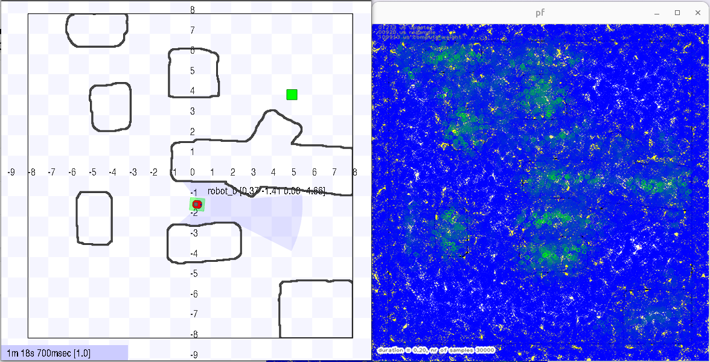
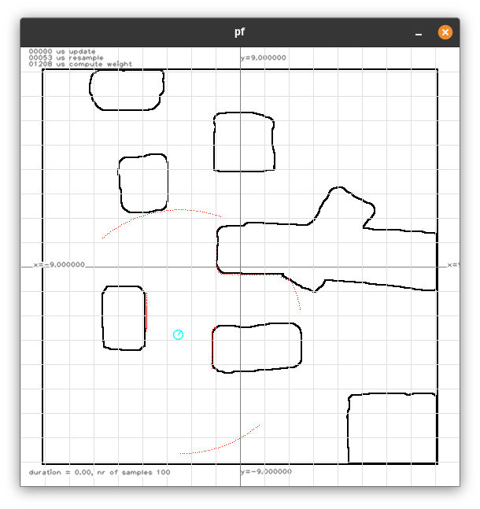
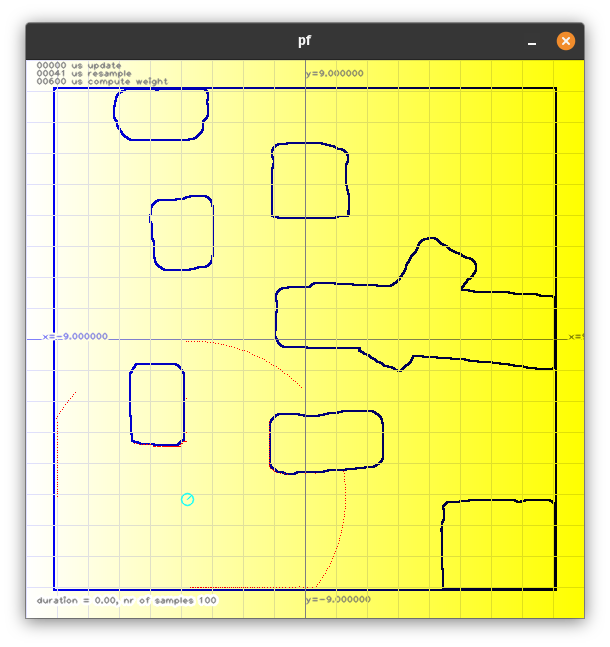
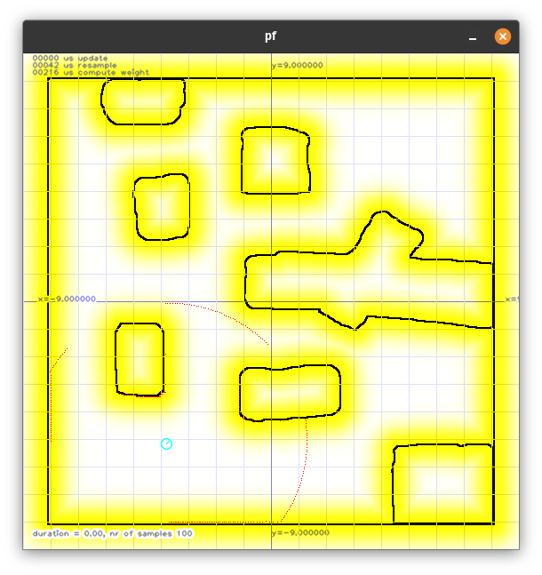
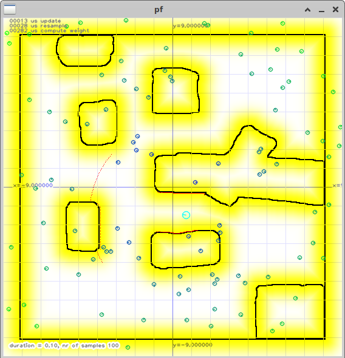
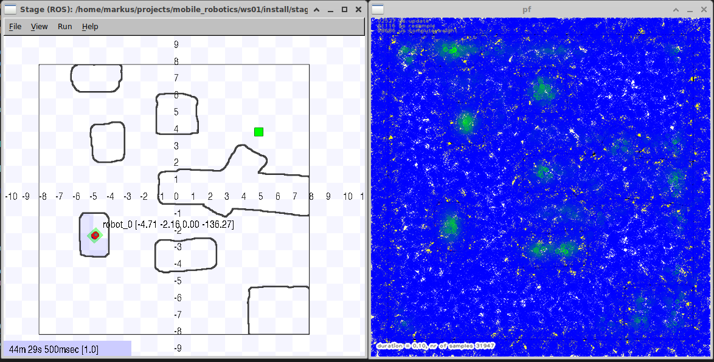
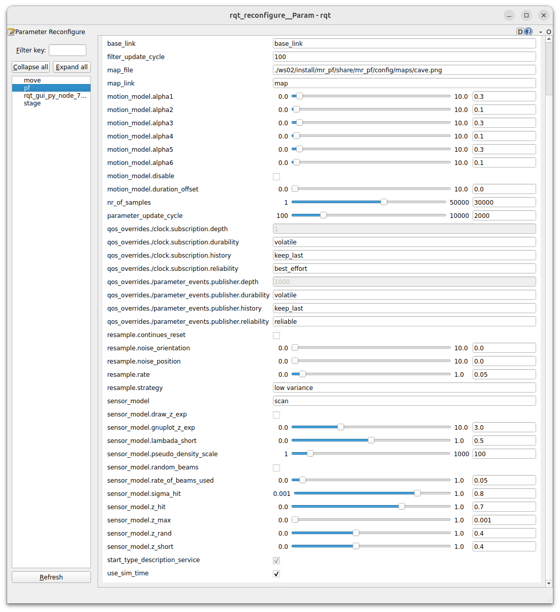
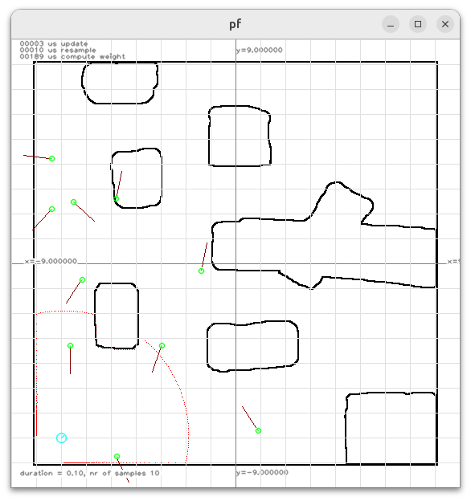
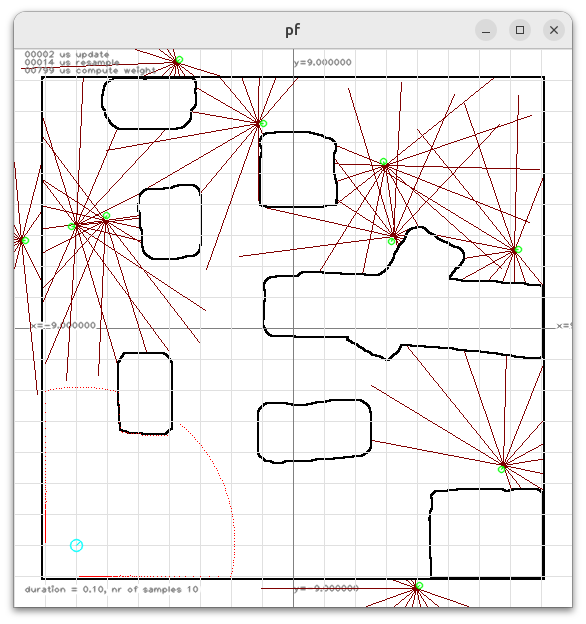
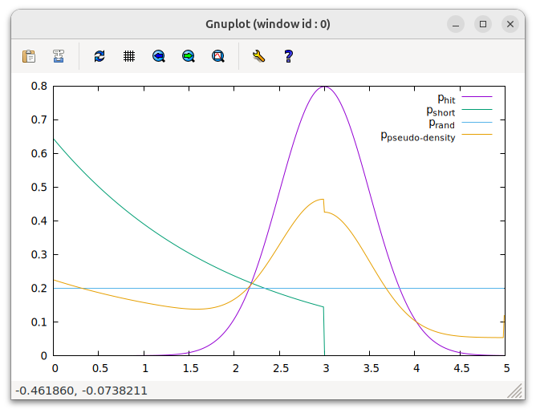

# Sensor Model
## Overview

This exercise focuses on the implementation of the sensor models of a particle filter. You need to implement a beam and scan base sensor model to calculate weights for a robot's states predictions $`x_t`$, depending on $`z_t`$, $`x_{t-1}`$ and $`m`$.

In the lecture you have learned two different approaches to this: the Beam Model and Scan Model. The latter you need to implement in this exercise.

For more information, also see S. Thrun, W. Burgard, and D. Fox, [Probabilistic Robotics - Chapter 6](https://tuwel.tuwien.ac.at/mod/resource/view.php?id=2397734) page 158 and 172.
`@ToDo` statements have been placed in the assignment code, to aid in completing this exercise.

You will be working with the `tuw_geometry` library, which already implements a lot of common geometric operations.
You are encouraged to use these implementations instead of re-implementing them.
The API reference can be found [here](https://docs.ros.org/en/humble/p/tuw_geometry/generated/index.html).


### Update the Exercise Environment
We made some modifications to the root repository. Pull the [root-mr](https://gitlab.tuwien.ac.at/lva-mr/2026/root-mr) and rebuild the devcontainer; it now mounts a persistent user folder (`.devcontainer/user`) into the container's home directory. This preserves your shell configurations (e.g., `.bashrc`, `.tmux.conf`, `.bash_histroy`) across rebuilds. We also provide tmux configurations in `$PROJECT_ROOT/tmux` for later use.


```sh
cd $PROJECT_ROOT
git pull
```

To run the node for this exercise, run the following commands to start the filter without the stage
```sh
ros2 run mr_pf pf_node \
	--ros-args \
	--params-file ./ws02/src/mr/mr_pf/config/particle_filter.yaml \
	--remap /scan:=/base_scan \
	--param sensor_model:=scan
```
or use the tmuxinator to start all at once using
```sh
tmuxinator start -p ./tmux/particle-filter.yml
```

## Basic idea of the scan-based sensor model
A naive implementation of the algorithm might look like this:
1. For a given state $x_t$ and a single measurement $`z_{t_k}`$ the coordinates at which the laser beam (supposedly) hit an obstacle are calculated in world coordinates.
2. The minimum distance from this "hit" to the next known obstacle in the map is calculated (a naive implementation would just go through all map cells, calculate their relative distances to the hit and take the minimum)
3. With the minimum distance and the measurement characteristics of the laser (parameters $`z_{hit}`$, $`\sigma_{hit}`$, $`z_{random}`$, $`z_{max}`$) the probability that $`z_{t_k}`$ was indeed obtained from $x_t$ can be calculated. This probability is also known as the weight of the measurement.

As a complete laser scan contains many single measurements, these steps have to be performed for every single measurement of the scan (which can be performance intensive).
For each $x_t$, the weights of all single measurements have to be multiplied.
The resulting total weight specifies how well the laser scan matches a certain pose in the map.


Following this idea gives us a first approach to localize a robot in a map:

* The correct pose of the robot __is unknown__.
* The current laser measurements and a map __is known__.
* We now distribute many particles (> 10000) - each particle represents a possible pose - and calculate their respective weights. The particle with the highest assigned weight most likely represents the correct pose of the robot.



In the version of the algorithm that we will be implementing, we will be making use of the static nature of the map and the characteristics of our laser scanner:
This is done by pre-computing the probability that a measurement which falls into a map cell is the result of the real laser beam hitting an obstacle.
The resulting matrix is denoted as the Likelihood Field from now on.

## 1. `tf2` (15 Points)

In Exercise 2, the laser sensor's pose was hard-coded to $0.15m$. In this exercise, the same needs to be achieved using ROS [TF2](https://docs.ros.org/en/jazzy/Tutorials/Intermediate/Tf2/Tf2-Main.html#tf2) instead.

* Finish `PFNode::callback_laser`
	* Lookup the transformation from the `base_frame_` to the message's frame.
	* Set `pose_sensor`.
	* Calculate the correct `Polar2D` and `Point2D` values for every laser beam.
* Finish the function `ParticleFilterVisualization::plot_laser_measurement`
	* Apply the `pose_vehicle` and `tf_base_sensor_` transformation to the sensor beams before plotting.

After populating the laser measurements, the endpoints can be viewed in `mr_pf`. 




## 2. Likelihood Field Visualization (5 Points)

Finish `ParticleFilterVisualization::plot_likelihood_field`

* Calculate the maximum value of `likelihood_field_`.
* Update every pixel of `figure_->background()` to the corresponding (scaled) value in the likelihood field.

Be aware that the values in the `likelihood_field` are between 0 and 1. The computation of the likelihood field is your next task but for the moment you should get something like this.




## 3. Likelihood Field Computation (10 Points)

Finish `ParticleFilter::compute_likelihood_field`

Different approaches to this task exist, however we recommend to utilize the functions provided by OpenCV and Boost. We have also noted these functions in the hints before the exercise.

* You need to calculate the minimum distance of every point in the map to the nearest known obstacle. For this, we recommend `cv::distanceTransform()` (refer to the [openCV](https://docs.opencv.org/4.5.1/d7/d1b/group__imgproc__misc.html#ga25c259e7e2fa2ac70de4606ea800f12f) online documentation). No matter which way you choose, the final result has to be stored in the array `ParticleFilter::distance_field_pixel_`.
* The calculated distances are pixel values and therefore have to be transformed into meters. For that you can use `map_header_.scale_x()`.
* Lastly, the distances have to be converted to probabilities using a Gaussian distribution with standard deviation $\sigma_{hit}$ (defined by `ParticleFilter::param_.sigma_hit`), i.e. a distance of 0 should correspond to the peak value of the distribution and the larger the distance is, the smaller the likelihood values should be. The resulting field must be stored in `ParticleFilter::likelihood_field_`. 

The boost library offers a function called `boost::math::pdf`, that can be used in conjunction with the given `normal_distribution_` variable.




## 4. Sample Plotting (10 Points)
`ParticleFilterVisualization::plot_samples` should plot the samples of the particle filter. Adjust the color of each sample, such that it is relative to `samples_weight_max_`. You can use `figure_->symbol` to plot a symbol.

* Complete `ParticleFilterVisualization::plot_samples` by plotting all samples using `figure_->symbol`
* Adjust the color of each sample, depending on the sample's weight and `samples_weight_max_`

Hints:
* The screenshot below shows a visualization for particles with differing weights. This is not the case until you have implemented the next subtask, so you might want to re-visit this section later. Alternatively, you can test your coloring by using `normal_distribution_()`.
* Use only few (< 100) particles for testing 




## 5. Weight of particles using scan-based sensor model with likelihood field lookup (17 Points)

Finish the function object / lambda expression `weight_sample_scan_model` in  `ParticleFilter::compute_weights`. The lambda expression `weight_sample_scan_model` is called for every sample.

Hint:

* Use many (> 2000) particles for testing 
* Reduce the number of beams used
* Increase `sigma_hit`
* The pseudo code of the computation can be found in the book Probabilistic Robotics on page 172 (Table 6.3)

If your visualization is working, you should now see particles in "correct" locations highlighted.





## 6. Beam-based Sensor model (25 Points)

**Hint:** This is quite challenging. You might want to complete the Question and review the documentation before coming back to this. 

**Prerequisites:**

* Use only a few samples for the beginning (e.g., `-p nr_of_samples:=10`).
* Set the parameter `-p sensor_model:=beam`.
* Set the parameter `-p sensor_model.draw_z_exp:=true`.

### Compute and plot expected measurments (10 Points)
 
Finish the function `ParticleFilterVisualization::plot_expected_measurments()`. If `ParticleFilter::compute_expected_measurment` is not finished you will see something like this.



Finish the function `ParticleFilter::compute_expected_measurment`. Now the plot should show you the beams used.




### Compute the pseudo-density lookup (10 Points)

Finish the function `ParticleFilter::compute_pseudo_density_lookup`. This function should populate the lookup table `pseudo_density_fnc_` and generate a gnuplot file at the expected measurement `param_->gnuplot_z_exp`, which can be viewed using the following command.

```bash
gnuplot -e "set terminal wxt noraise; while (1) { plot \
    '/tmp/pseudo-density.txt' using 1:2 with lines title 'p_{hit}', \
	'/tmp/pseudo-density.txt' using 1:3 with lines title 'p_{short}', \
	'/tmp/pseudo-density.txt' using 1:5 with lines title 'p_{rand}', \
	'/tmp/pseudo-density.txt' using 1:6 with lines title 'p_{pseudo-density}'; \
	pause 1 }"exit
```

You might have to install gnuplot using `sudo apt install gnuplot`.




### Weight of particles using beam-based sensor model with pseudo-density lookup (5 Points)

Finish the function object/lambda expression `weight_sample_beam_model` in `ParticleFilter::compute_weights`. The lambda expression `weight_sample_beam_model` is called for every sample.

Set the parameter `-p sensor_model.draw_z_exp:=false` to ensure a clean view of the map, and increase the number of samples to `-p nr_of_samples:=10000`. You should now be able to generate images similar to those produced by the scan-based model.


## 7. Python Launch Files (7 Points)
There is a launch file `pf_launch.py` which allows you to launch the mr_pf node with the following commands

```sh
cd $PROJECT_ROOT
ros2 launch mr_pf pf_launch.py particle_filter_params_file:=./ws02/install/mr_pf/share/mr_pf/config/particle_filter.yaml particle_filter_map_file:=./ws02/install/mr_pf/share/mr_pf/config/maps/cave.png level:=0
```
Your task is to modify the `pf_launch.py` to enable the launch file to use relative file names for the `particle_filter_params_file` and `particle_filter_map_file` (3 Points).
The path for `particle_filter.yaml` should be relative to `$PROJECT_ROOT/ws02/install/mr_pf/share/mr_pf/config/` and for the map png (`cave.png`) file relative to `$PROJECT_ROOT/ws02/install/mr_pf/share/mr_pf/config/maps/`.
In the end, you should be able to launch the project regardless of your current working directory.
The only part hard-coded should be the information for the path relative to the package.
```sh
cd $HOME
ros2 launch mr_pf pf_launch.py particle_filter_params_file:=particle_filter.yaml particle_filter_map_file:=cave.png level:=0
```
Next modify it in such a way that you can use absolute and relative paths for the `particle_filter_map_file` argument (2 Points). If the parameter argument has no 'slash' it should be treated as a relative path.
The variable `pkg_name` should not be hard-coded (1 Point).
The code part that defines the arguments given to the node (`parameters=` and following lines) should not be modified. (1 Point).

Hint: One way to do it is by using OpaqueFunctions.

## 8. Questions (6 Points)

Create a markdown document named `questions_ex3_{YOUR_STUDENT_ID}.md` (without the {}) in the `ws02/src/mr/exercises` folder containing three multiple-choice questions related to the exercise: two based on the content of this exercise and one based on the lecture theory.
Each question sentence and its four answer options must be no longer than 200 characters each and the question title not longer than 50 characters.
The document must follow the format below and in markdown style:
Replace **YOUR_NAME**, **YOUR_STUDENT_ID**, **TRUE**, and **FALSE** with your actual name and student ID.
Set the answer to **true** if the option is correct; otherwise, set it to **false**.
Check if your last questions from ex1 and ex2 are updated to the new format given and add a question title when needed.
One point per question (3 Points), one point for updating previous exercises' questions to the new format (1 Point), two points for correct formatting (2 Points).

```
# Mobile Robotics
## Questions
* Author: YOUR_NAME
* StudentID: YOUR_STUDENT_ID
* Semester: 2026S

### Exercise 3

#### Exercise Questions
##### Question title
The question sentence.
* [FALSE] Answer option 1
* [TRUE] Answer option 2
* [FALSE] Answer option 3
* [FALSE] Answer option 4

##### Question title
The question sentence.
* [TRUE] Answer option 1
* [TRUE] Answer option 2
* [FALSE] Answer option 3
* [TRUE] Answer option 4

#### Lecture Question
##### Question title
The question sentence.
* [FALSE] Answer option 1
* [TRUE] Answer option 2
* [TRUE] Answer option 3
* [FALSE] Answer option 4
```

## 10. Documentation (5 Points)

* Your documentation should not be more than 4-5 pages (excluding title page) with screenshots but __no code__. (1 Point)
* Document every part with screenshots. (2 Points)
* The first page includes your full name and student ID, and a table showing how many points you think you have reached. (1 Points)
* Document your working hours. We would like an estimate of how long it took you to finish exercise. (1 Points)

## Submission

tar.gz your project using

```sh
  cd $PROJECT_ROOT/ws02/src/
  tar --exclude-vcs -czvf mr.tar.gz mr
  # If you would like to generate a tagged tar file with the date in the file name, you can use the following command:
  # tar --exclude='.git' -czvf mr_`date +"%Y-%m-%d--%H-%M"`.tar.gz -C $PROJECT_ROOT/ws02/src mr*
```

Submit the _tar.gz_ file and your documentation as a _pdf_ with a brief documentation (screenshots showing your success) in a separate file.

## Optional Exercises and Extra Points (5 Points)

### Map file (2 Points)
Check in `ParticleFilterNodeParameter::callback_update_parameters` if the map file really exists and plot a `RCLCPP_FATAL` message if not.

### Compare sensor models (3 Points)
Compare the scan-based sensor model with the beam-based sensor model, providing at least 3 screenshots showing the differences.

### Optional exercises
- Implement some form of beam selection in the highlighted section of the `compute_weights()-function`.
- Extend the `pf_launch.py` file to launch _Stage_ using the same map argument as for the particle filter as well as your __mr_move__ with a mode parameter.
