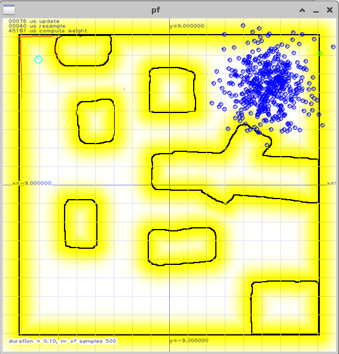
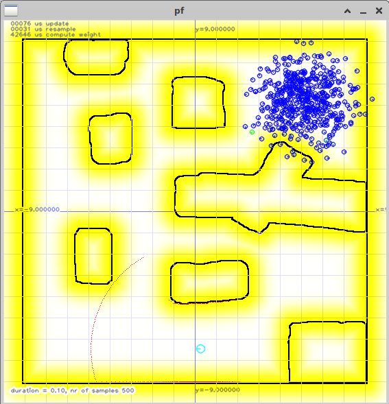
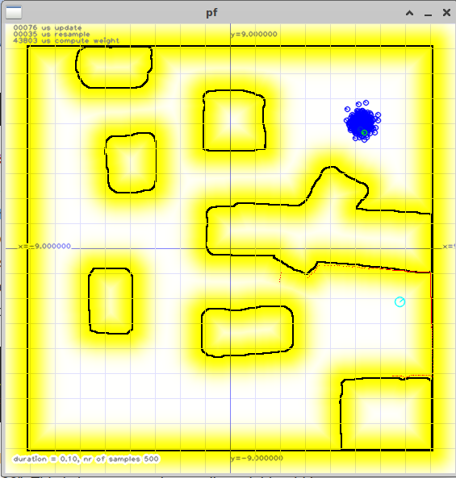
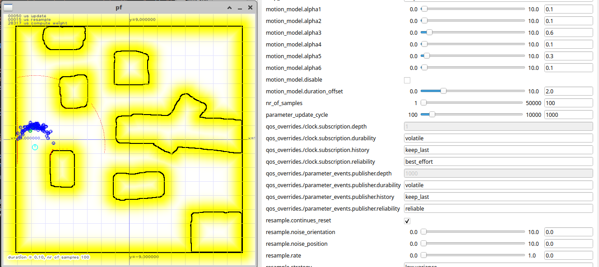
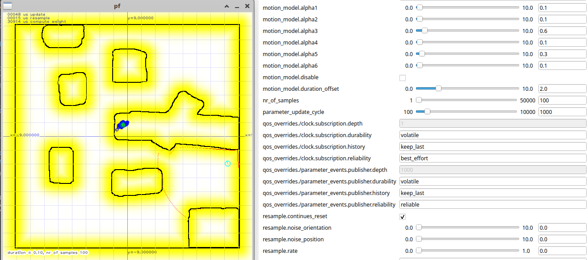
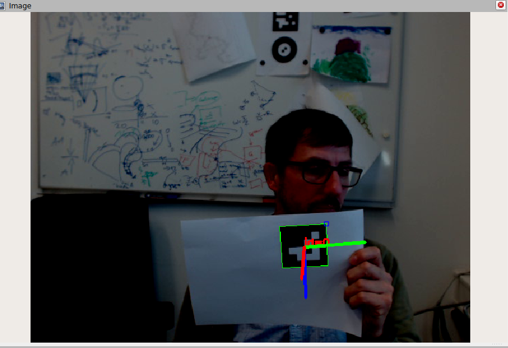

# Motion Model

## Overview

This is the last step to finish your first self-localization using a particle filter.
This exercise covers the topics:

* __React to mouse clicks__ <br/>
You should be able to click within the map view and distribute particles where you have clicked in a Gaussian distribution according to `resample_noise_position` and `resample_noise_orientation`.
* __Motion Model__
* __Re-sample particles__ <br/>
After you weighted your particles you should remove “bad” particles with a low weight and should clone “good” particles with a high weight value. The number of particles to re-sample are defined by the `resample_rate` parameter. We like you to implement two versions of the re-sampling.
  * A very simple approach, remove the _M_ lowest weighted particles and clone the top _M_ weighted ones. (_M_ is related to `config_.resample_rate`)
  * Use the re-sample wheel presented in the lecture along with low variance sampling to re-sample particles (Thrun 2005 on page 109).
* __ROS-Tooling__

The exercise is divided into multiple parts:

1. React to mouse clicks (10 Points)
2. Motion Model (30 Points)
3. Re-sampling (37 Points)
4. Little Helpers (12 Points)
5. Questions (6 Points)
6. Documentation (5 Points)

## Programming assignments (77 Points)

You will find “@ToDo” statements in the code matching the assignment name. Additionally, the assignment usually points you to a function where to find those ToDos.

We expect you to write, replace or enhance the code within the else statement. The if statement is used by the Tutors to host our demo solution. But, if you like to make changes somewhere else, you are welcome but you must be able to explain your changes if needed.

Familiarize yourself with existing class variables and function-local variables. There's almost no need to introduce new variables, since everything is already prepared for you.


### 1. React to mouse clicks (10 Points)


You have to write code within the `ParticleFilterVisualization::callback_mouse(int event, int x, int y)` function. 
The code for the particle redistribution exists and it will be triggered once if the variable `reset_` is set true unless the parameter `param_->continues_reset` is true.
Your task is to compute a pose (position and orientation) to initialize the filter based on the mouse button left down and up click.
Therefore you have to call the function `ParticleFilter::set_init_pose(const Pose2D &p)` and set `reset_` to the enum `Reset::INTI_POSE`;

Don't forget to add Gaussian noise to the samples!

 </br>
 </br>
 </br>

### 2. Motion Model (30 Points)

__Prerequisites:__
To test the motion model, the samples should be reset continuously to a single pose (the current ground_truth pose, or the init pose) before each motion update. This can be achieved by setting the parameter `param_->continues_reset` to true and clicking with the right or left mouse button in the map (if the previous step was correctly implemented).

__Implementation (20 Points)__

The ToDo for this task is located in the function `void ParticleFilter::update(const Command2DConstPtr u, double dt)`.
The duration for one update cycle is normally tied to the ROS parameter `filter_update_cycle`, which is 0.1 seconds per default.
This is too low to generate nice plots like the one in the figures shown, and increasing this value reduces the frame rate of the simulation, making debugging tedious.
We have already created another ROS parameter called `motion_dt_override`: if it is larger than 0, your motion model should use the value of this parameter for the forward prediction instead of the value passed as an argument to the function.

 </br>
 </br>

__Detailed Documentation (10 Points)__

Document your solution, describe the influence of different alpha values. What happens when you change them? How does the sample distribution look like for different values? Which alpha value influences what? (5 points for a nice banana shaped distribution, 5 points for the description of the six alpha values with screenshots)

### 3. Re-sampling (27 Points)
This is the last step to finish your own self-localization.

Re-sampling has to be done in `ParticleFilter::resample()`. As mentioned we want you to implement two strategies based on the enum `param_->resample_strategy`. 

1. The strategy `KEEP_BEST` is a very simple approach. Remove the _M_ lowest weighted particles and clone the top _M_ weighted ones (10 Points).

2. The strategy `LOW_VARIANCE` is a low variance sampling (Thrun 2005 on page 109) (10 Points).

When cloning, you should also add a small noise onto the new particle. (7 Points) 
Hint: use `SamplePose2DPtr &ParticleFilter::sample_normal(SamplePose2DPtr &des, tuw::Pose2D &src, double sigma_position, double sigma_orientation)`.

## C++ (10 Points)
You don't need to answer this question in your documentation; however, if you would like to earn these points, we will ask you a question during the submission talk that you must be able to answer.

* What are capture clauses in C++ lambda functions, and how and where do we use them?
* Since c++11 we have Range-based for loop like:
  ```cpp 
  std::vector<int>         ids     = {5, 4, 3};
  for (size_t i : ids){
    ....
  }
  ```
  but you could also write
  * `for (auto i : ids) ...` 
  * `for (auto &i : ids) ...` 
  * `for (const auto &i : ids) ...`
  What's the difference, and when should each be used?
* What new feature is there in c++ 23 if you like to iterate over two or more containers like using Range-based for loops
  ```cpp 
  std::vector<int>         ids     = {5, 4, 3};
  std::vector<std::string> names   = {"Alice", "Bob", "Charlie"};
  for (size_t i = 0; i < names.size(); i++){
    std::cout << ids[i] << " " << names[i] << std::endl;
  }
  ```


## Little Helpers (12 Points)

* Show how to publish a topic with `rqt` (2 Point)
* Connect a webcam and pass the camera device through into your docker container (2 Points for screenshot of a `/dev/videoX` device path in the container)
* Get `usb_cam` working https://github.com/ros-drivers/usb_cam (2 Points if you show a screenshot of yourself in rviz and document the needed steps))
* Calibrate your camera with https://docs.nav2.org/tutorials/docs/camera_calibration.html (2 Points if you show a screenshot with the calibration pattern detected)
* Apply the camera calibration to the published ros images (2 Points for showing raw and rectified camera images side-by-side in rviz)
* Get an aruco marker library or other qr-tag marker library working (2 Points for a screenshot of a detected aruco Pattern and yourself) Hint: `ros_aruco_opencv` works quite well
 </br>


## Questions (6 Points)

Create a markdown document named `questions_ex4_{YOUR_STUDENT_ID}.md` (without the {}) in the `ws02/src/mr/exercises` folder containing three multiple-choice questions related to the exercise: two based on the content of this exercise and one based on the lecture theory.
Each question sentence and its four answer options must be no longer than 200 characters each and the question title not longer than 50 characters.
The document must follow the format below and in markdown style:
Replace **YOUR_NAME**, **YOUR_STUDENT_ID**, **TRUE**, and **FALSE** with your actual name and student ID.
Set the answer to **true** if the option is correct; otherwise, set it to **false**.
One point per question (3 Points), three points for correct formatting (3 Points).

```
# Mobile Robotics
## Questions
* Author: YOUR_NAME
* StudentID: YOUR_STUDENT_ID
* Semester: 2026S

### Exercise 4

#### Exercise Questions
##### Question title
The question sentence.
* [FALSE] Answer option 1
* [TRUE] Answer option 2
* [FALSE] Answer option 3
* [FALSE] Answer option 4

##### Question title
The question sentence.
* [TRUE] Answer option 1
* [TRUE] Answer option 2
* [FALSE] Answer option 3
* [TRUE] Answer option 4

#### Lecture Question
##### Question title
The question sentence.
* [FALSE] Answer option 1
* [TRUE] Answer option 2
* [TRUE] Answer option 3
* [FALSE] Answer option 4
```


## Documentation (5 Points)

* Your documentation should not be more than 4-5 pages (excluding title page) with screenshots but __no code__. (1 Point)
* Document every part with screenshots. (2 Points)
* The first page includes your full name and student ID, and a table showing how many points you think you have reached. (1 Points)
* Document your working hours. We would like an estimate of how long it took you to finish the exercise. (1 Points)


## Submission

tar.gz your project using

```sh
  cd $PROJECT_ROOT/ws02/src/
  tar --exclude-vcs -czvf mr.tar.gz mr
  # If you would like to generate a tagged tar file with the date in the file name, you can use the following command:
  # tar --exclude='.git' -czvf mr_`date +"%Y-%m-%d--%H-%M"`.tar.gz -C $PROJECT_ROOT/ws02/src mr*
```

Submit the _tar.gz_ file and your documentation as a _pdf_ with a brief documentation (screenshots showing your success) in a separate file.


## Optional Exercises and Extra Points (5 Points)

### Triangular distribution
Use a triangular distribution instead of a Gaussian distribution and document the performance gain.
