# EKF Self-Localization

## Overview

In this exercise you have to implement an extended Kalman filter (EKF) for Self-Localization using line features.
You have to implement the robot pose prediction with visualization similar to the particle filter, but the EKF uses a covariance matrix to represent the pose uncertainty instead of multiple particles.
The line detection is given but you have to implement a matching strategy to find the best match.
The final step to implement involves the pose correction step based on the matched line measurements.
The following figure shows a working Kalman filter on the left, the feature matching and known lines in Hough-space in the middle and the running simulation on the right. One can see the magenta error ellipse around the robot which will get smaller with a better pose prediction.

The exercise must be submitted until the respective TUWEL submission deadline. Don't hesitate to ask questions. We offer different ways to contact us (ask questions after lecture, e-mail, chat and gitlab issues).

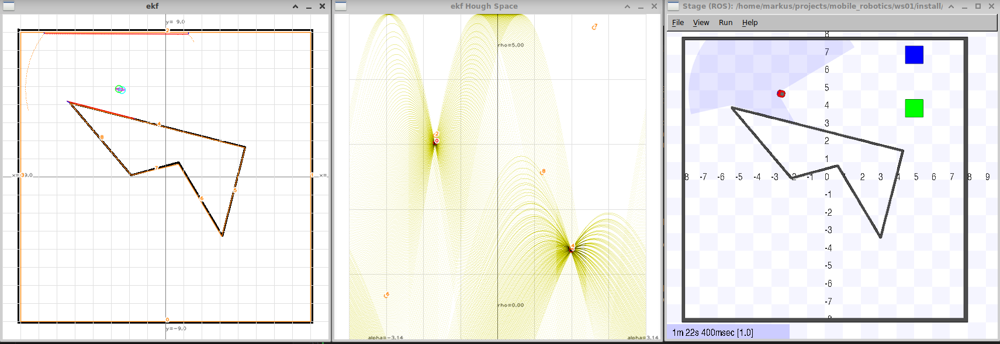 </br>

The exercise is divided into multiple parts:

1. Coding (84 Points)
2. ROS Tooling (5 Points)
3. Questions (6 Points)
4. Documentation (5 Points)

__Programming assignments:__ You will find `@ToDo` statements in the code matching the task. Additionally, the assignment usually points you to a function where to find those ToDos.
We expect you to write, replace or enhance the code. If you want to make changes somewhere else, you are welcome to do so, but please highlight the changes in the code and mention them in the documentation.

## Framework update

### Clone projects
We suggest to update all your repos by calling `git pull` in your project root.
Afterwards you have to pull the `mr` repository and to clone the project *tuw_laserscan_features* with `make ws01/src/tuw_laserscan_features`.
It includes a node which detects and publishes line segments in the laser scan for use by our filter.
### Build framework
```sh
cd $PROJECT_ROOT/src/mr
git pull
cd $PROJECT_ROOT
make ws01/src/tuw_laserscan_features
make build-ws01
make build-ws02
```

### Start the framework
We suggest the line environment. It makes sense to use tmux with three or more windows to launch the following programs.
```sh
ros2 launch stage_ros2 stage.launch.py world:=lines
ros2 run mr_move move --ros-args -r scan:=base_scan -p mode:=demo
ros2 run tuw_laserscan_features composed_node --ros-args -r scan:=base_scan
ros2 run mr_ekf ekf_node --ros-args -r scan:=base_scan --params-file ./ws02/install/mr_ekf/share/mr_ekf/config/ekf_params.yaml
```
Within the project root you will also find a tmuxinator config. If you have tmuxinator installed you can just call `tmuxinator start -p tmux/ekf.yml`.
```sh
cd $PROJECT_ROOT
tmuxinator start -p ./tmux/ekf.yml
```

## Coding (84 Points)

### 1. Visualization name and init pose (2 Points)
Write your name into the figure. You will find a ToDo in *EKFVisualization::draw(int delay)*. Furthermore, implement the mouse callback to set the initial position. You will find a ToDo in *EKFVisualization::callback_mouse(int event, int x, int y)*.

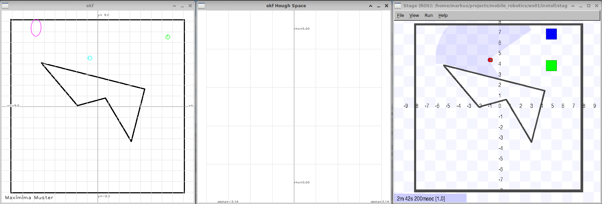 </br>

### 2. Map line segments (2 Points)
Implement the *line drawing of the known map_linesegments_* in *EKFVisualization::draw_measurement(const Pose2D &pose_vehicle)*.

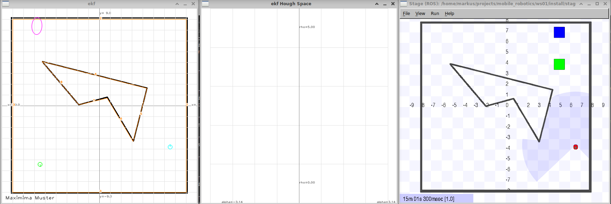 </br>

### 3. Pose prediction (5 Points)
Implement the *pose prediction* in the forward prediction *EKF::prediction(const Command2DConstPtr u, double dt)* without the covariance prediction. You should see the robot now driving.

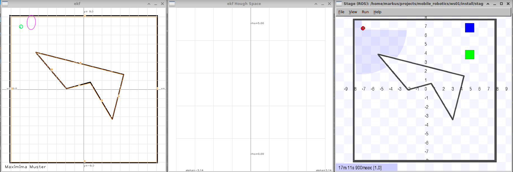 </br>

### 4. Drawing of the laser scan (5 Points)
Implement the *drawing of the laser scan* in *EKFVisualization::draw_measurement(const Pose2D &pose_vehicle)*.

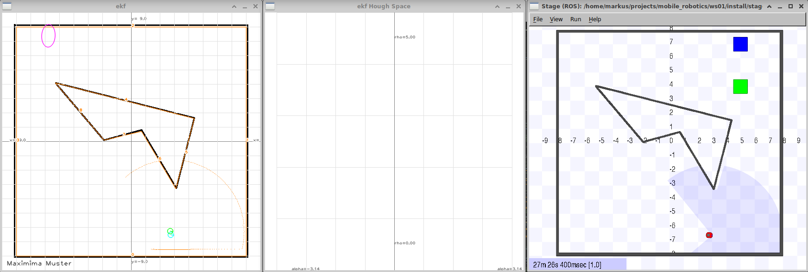 </br>

### 5. Drawing of measurement line segments (5 Points)
Implement the *drawing of measurement linesegments* in *EKFVisualization::draw_measurement(const Pose2D &pose_vehicle)*, but without the matching.

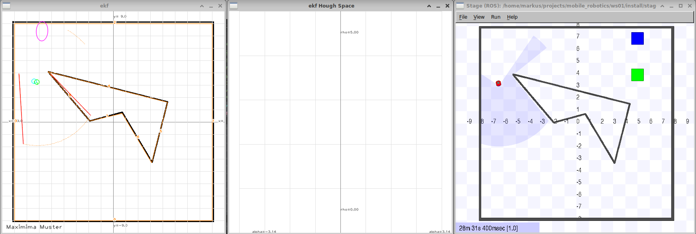 </br>

### 6. Covariance prediction (10 Points)
Implement the missing *covariance prediction* in the forward prediction *EKF::prediction(const Command2DConstPtr u, double dt)*.

### 7. Covariance drawing (5 Points)
Implement the missing *covariance drawing* in *EKFVisualization::draw_covariance()*. You should draw the 95% ellipse.

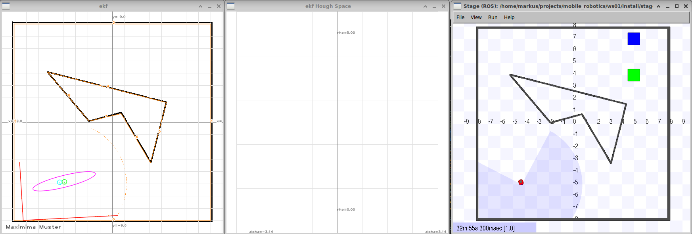 </br>

### 8. Laser beams in Hough space (5 Points)
Implement the *draw laser beams in hough space* in *EKFVisualization::draw_hspace()*.

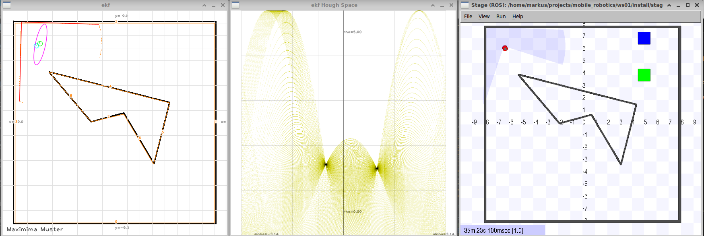 </br>

### 9. Measurement in Hough space (5 Points)
Implement the *measurement in hough space* in *EKFVisualization::draw_hspace()*.

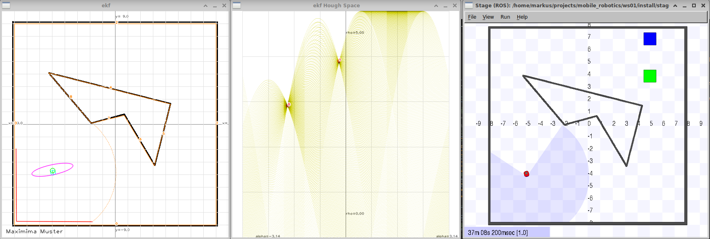 </br>

### 10. Predicted line segments (10 Points)
Implement the *predicted linesegments* in *EKF::data_association()*.

### 11. Prediction measurement in Hough space (5 Points)
Implement the *prediction measurement in hough space* in *EKFVisualization::draw_hspace()*.

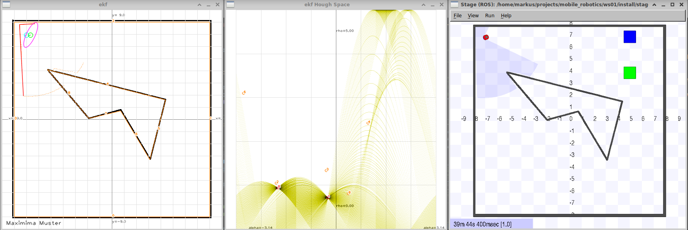 </br>

### 12. Matching measurement with prediction (10 Points)
Implement *the matching measurement with prediction* in *EKF::data_association()*.

### 13. Draw matching (5 Points)
Update *drawing of the measurement linesegments* in *EKFVisualization::draw_measurement(const Pose2D &pose_vehicle)* to draw the matching.

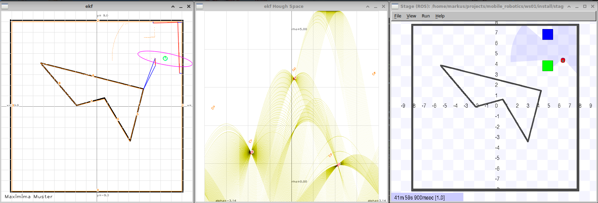 </br>

### 14. Pose correction (5 Points)
Implement the missing *pose correction* in *EKF::correction()*.

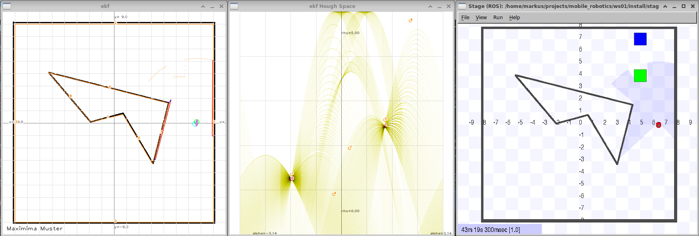 </br>


## Debug vs. Release (5 Points)
Document the performance gains of your particle filter and EKF implementations when compiling in Debug and Release modes. Release mode includes the `-O3` optimization flag.

## ROS Tooling (5 Points)
There are no `To-Do`'s for this part.
If you are looking for points, do the bonus exercises first.

### Use the tuw_shape_array package instead of the yml files with lines
Currently, the feature maps used by the filter are read from a dedicated .yml-files in the config directory.
This is not ideal; the README of the `tuw_shape_array` package shows you how to publish a message depicting the cave environment.
It can be found in the [`tuw_object`](https://github.com/tuw-robotics/tuw_object)-repository.
To get this one running, you have to get the latest versions of [`tuw_msgs`](https://github.com/tuw-robotics/tuw_msgs), [`tuw_json`](https://github.com/tuw-robotics/tuw_json) (a dependency of this package is missing in our container - you will have to install it yourself!), [`tuw_ros2_utils`](https://github.com/tuw-robotics/tuw_ros2_utils) and[`tuw_rviz`](https://github.com/tuw-robotics/tuw_rviz) packages to view the lines in rviz.
It is up to you to figure out where to place your code so that a recieved `ShapeArray`-msg ist used instead of the yml file.
Hint: You will have to modify the `CMakeLists.txt`-file to link the ekf node against the required packages.

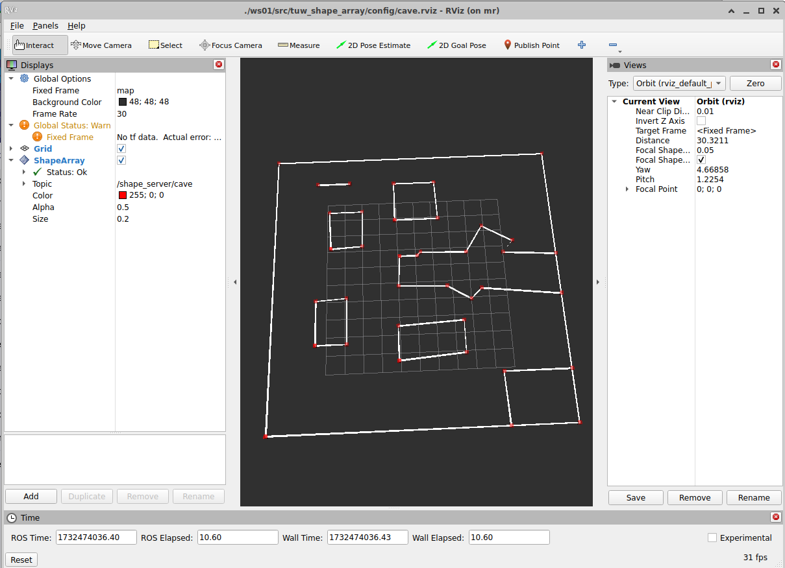 

## Questions (6 Points)

Create a markdown document named `questions_ex5_{YOUR_STUDENT_ID}.md` (without the {}) in the `ws02/src/mr/exercises` folder containing three multiple-choice questions related to the exercise: two based on the content of this exercise and one based on the lecture theory.
Each question sentence and its four answer options must be no longer than 200 characters each and the question title not longer than 50 characters.
The document must follow the format below and in markdown style:
Replace **YOUR_NAME**, **YOUR_STUDENT_ID**, **TRUE**, and **FALSE** with your actual name and student ID.
Set the answer to **true** if the option is correct; otherwise, set it to **false**.

* One point per question for single-answer questions.
* Two points for questions formatted as: "Which statement regarding [topic/field/subject] is correct?"

```
# Mobile Robotics
## Questions
* Author: YOUR_NAME
* StudentID: YOUR_STUDENT_ID
* Semester: 2026S

### Exercise 5

#### Exercise Questions
##### Question title
The question sentence.
* [FALSE] Answer option 1
* [TRUE] Answer option 2
* [FALSE] Answer option 3
* [FALSE] Answer option 4

##### Question title
The question sentence.
* [TRUE] Answer option 1
* [TRUE] Answer option 2
* [FALSE] Answer option 3
* [TRUE] Answer option 4

#### Lecture Question
##### Question title
The question sentence.
* [FALSE] Answer option 1
* [TRUE] Answer option 2
* [TRUE] Answer option 3
* [FALSE] Answer option 4
```

## Documentation (5 Points)

* Your documentation should not be more than 4-5 pages (excluding title page) with screenshots but __no code__. (1 Point)
* Document every part with screenshots. (2 Points)
* The first page includes your full name and student ID, and a table showing how many points you think you have reached. (1 Points)
* Document your working hours. We would like an estimate of how long it took you to finish the exercise. (1 Points)

## Submission

tar.gz your project using

```sh
  cd $PROJECT_ROOT/ws02/src/
  tar --exclude-vcs -czvf mr.tar.gz mr
  # If you would like to generate a tagged tar file with the date in the file name, you can use the following command:
  # tar --exclude='.git' -czvf mr_`date +"%Y-%m-%d--%H-%M"`.tar.gz -C $PROJECT_ROOT/ws02/src mr*
```

Submit the _tar.gz_ file and your documentation as a _pdf_ with a brief documentation (screenshots showing your success) in a separate file.

## Optional Exercises and Extra Points (5 Points)

### Publish the pose with covariance (3 Points)
Publish the pose as pose with covariance and as TF map->odom.

### Launch a map server (2 Points)
Launch a map server with a map and show the TF.

### Optional exercises
Derive a class from `tuw::StampedData` (found in the `tuw_geometry`-package) for array-like types of `data` and overload the `[]` operator to conveniently access specific elements.
Either place this class in `mr_ekf` and extend the `CMakeLists.txt` to build a tiny demo program, or create your own directory within `mr` to hold your class, the demo program as well as any files needed for building the code (eg. a Makefile, your own CMakelists, ...).